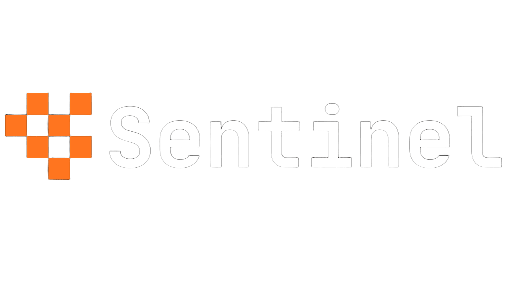
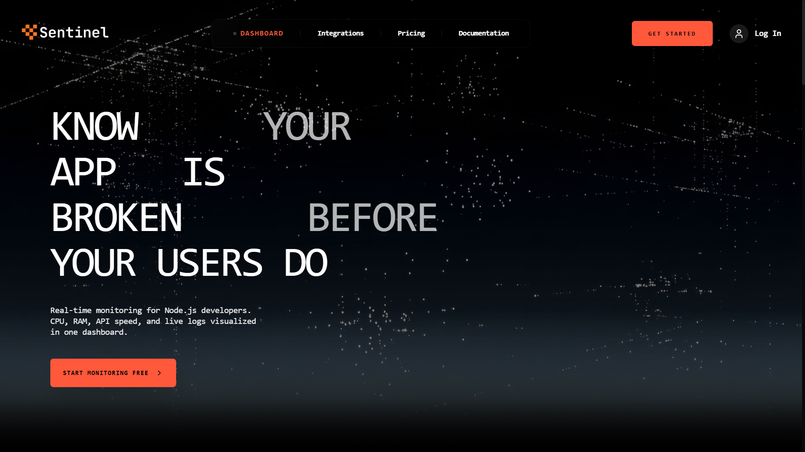

<div align="center">
  
  <p><b>Precision Observability for Modern Engineering Teams.</b></p>

  <p>
    
    
    
    
  </p>

  <p>Sentinel is not just a dashboard—it's a high-resolution window into your application's architecture. Built for developers who demand sub-second telemetry and AI-driven forensic analysis.</p>

  <a href="https://github.com/Utkarsh1087/Sentinel/stargazers">⭐ Star us on GitHub</a>
</div>

---

## 🖼️ The Command Center
<div align="center">
  
</div>

---

## ⚡ Why Sentinel?

While others show you logs, **Sentinel explains them.** We combine high-frequency time-series data with LLM intelligence to help you know your app is broken *before* your users do.

### 🚀 Key Capabilities
*   **Sub-Second Telemetry**: Real-time log broadcasting using a specialized Redis/Socket.io bridge.
*   **High-Resolution Metrics**: Millisecond-level CPU, RAM, and Latency tracking powered by **InfluxDB v2**.
*   **Forensic AI Diagnostics**: One-click error explanation using **Gemini-2.0-flash** to identify root causes instantly.
*   **Database Intelligence**: Real-time tracking of slow queries and operational bottlenecks.
*   **Zero-Trust Isolation**: Architected for absolute privacy with multi-project JWT security.

---

## 🛠️ The Tech Stack

| Layer | Technology | Role |
| :--- | :--- | :--- |
| **Frontend** | React + Tailwind | Fluid, high-density HUD |
| **Time-Series** | InfluxDB | Millisecond metric storage |
| **Metadata** | PostgreSQL | Relational project state |
| **Messaging** | Socket.io + BullMQ | Real-time streams & Alerting |
| **Caching** | Redis | Ingest buffering |
| **Brain** | Gemini LLM | Intelligent error analysis |

---

## 📦 Architecture Map

```text
├── 📱 dashboard/   # High-fidelity React interface
├── ⚙️ server/      # Node.js high-throughput gateway
├── 🔌 sdk/         # Lightweight Node.js ingestion client
├── 🧪 tester/      # Validation & Stress testing suite
└── 🧪 assets/      # Visual documentation assets
```

---

## 🏁 Getting Started

### 1. Requirements
*   **Node.js** 18.x or higher
*   **InfluxDB v2** (Metrics)
*   **Redis** (Ingest Cache)
*   **PostgreSQL** (Metadata)

### 2. Quick Deploy

```bash
# Clone the repository
git clone https://github.com/Utkarsh1087/Sentinel.git
cd Sentinel

# Setup Server
cd server
npm install
cp .env.example .env # Fill in your InfluxDB & Redis keys

# Setup Dashboard
cd ../dashboard
npm install

# Start the Command Center
npm run dev
```

---

## 🔐 Built-in Security
Sentinel enforces **Project Level Isolation**. Every packet is cryptographically verified to ensure your data remains your data. No leaks. No conflicts. Just pure observability.

---

<div align="center">
  <h3>Developed with precision for the modern web.</h3>
  <p>If you find Sentinel useful, consider giving us a 🌟 to support the development!</p>
</div>
